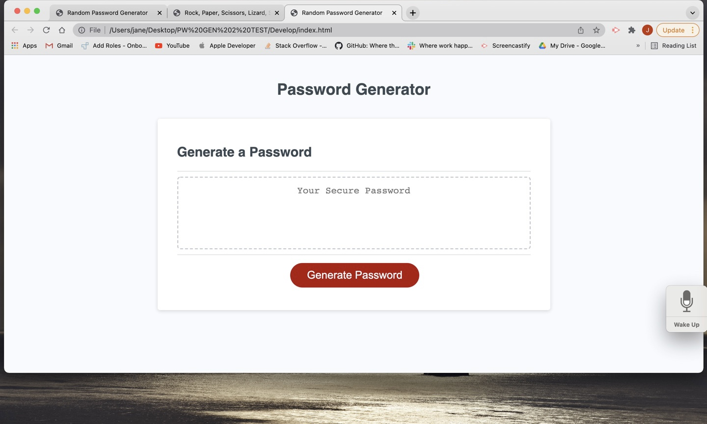
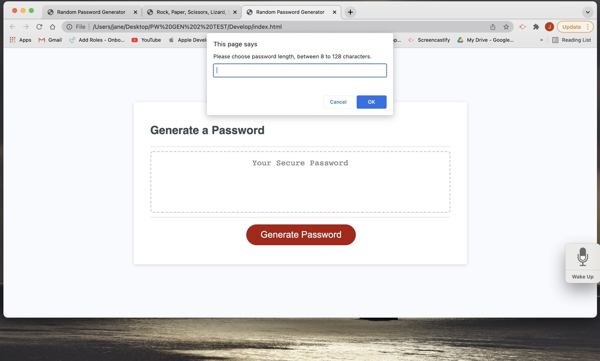
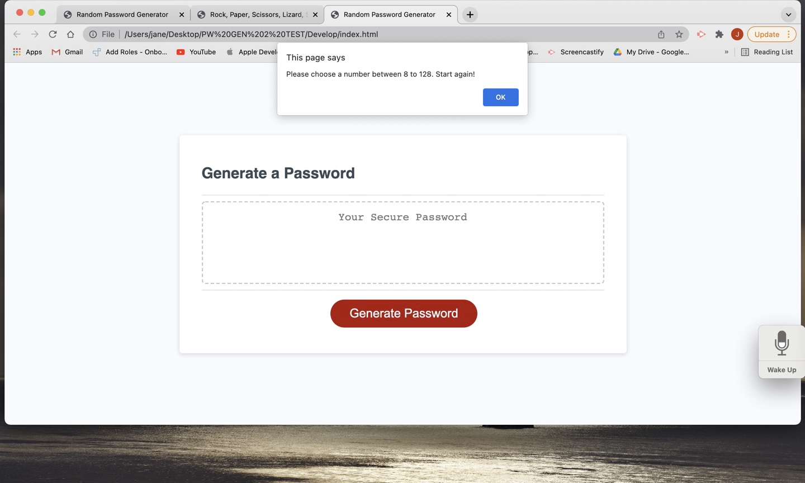
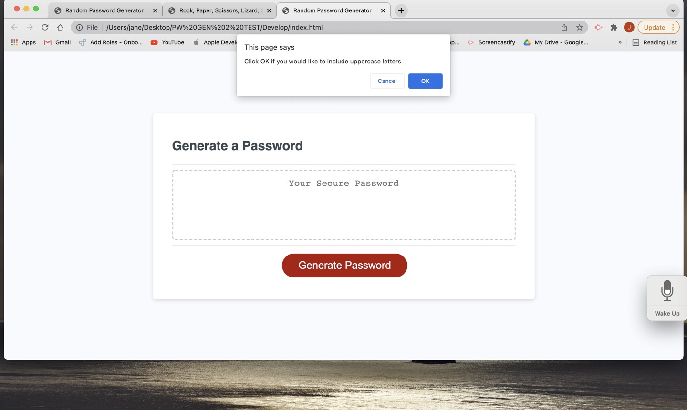
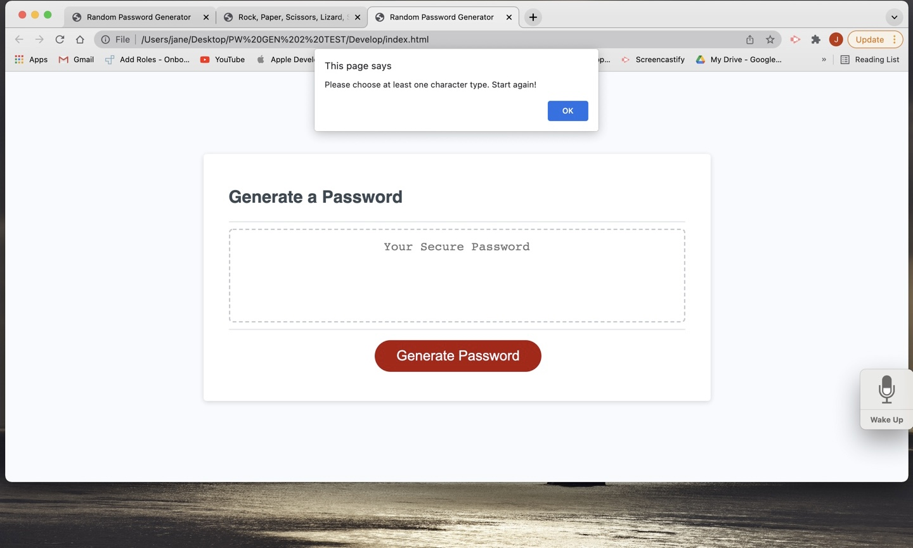
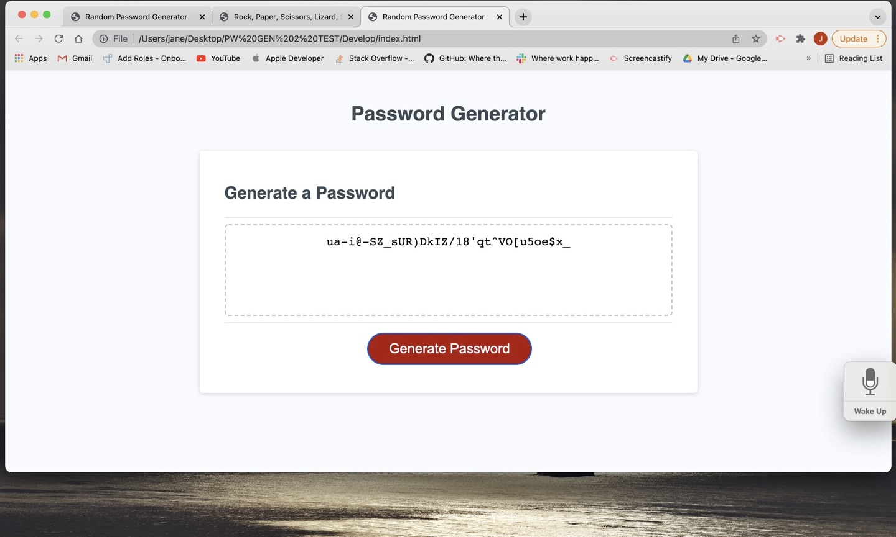

# 03 JavaScript: Password Generator

## Description

This project showcases the primary skills we have discussed on Javascript (Unit 3). 

As a web developer, I am required to modify a starter code to create an application that enables employees to generate random passwords based on criteria that they have selected. This app will run in the browser and will feature dynamically updated HTML and CSS powered by JavaScript code that I have written. It will have a clean and polished, responsive user interface that adapts to multiple screen sizes.

## Installation

This application does not require installation. This application runs in a browser while its HTML, CSS, JS, images, and README files can be accessed through the author's GitHub repository at https://github.com/jbtiglao.

  

## Usage

This application enables an employee (user) with access to sensitive data to generate a new and random password that meets certain criteria, so that he/she/they could create a strong password that provides greater security. 

In accordance with the acceptance criteria required of the project , the application has the following functionalities: 

- A Generate Password button, that when clicked by the user, the user is presented with a series of prompts for a password criteria;

- The password criteria includes the length of password and the inclusion/exclusion of uppercase and lowercase letters, numbers, and symbols (special characters);

- When the user is prompted for the length of password, the user will enter the password length which can be a minimum of 8 to a maximum of 128 characters.

 

- When the user enters a number that is less than 8 or more than 128, the user is prompted to choose a number between 8 and 128 and to start again (by clicking the Generate Password button);

  

- When the user chooses a number between 8 and 128, the user is then prompted with the succeeding criteria to include or exclude in the password: uppercase letters, lowercase letters, numbers, and/or symbols (special characters);

  

- The user will confirm the criteria they want to include by clicking OK on the appropriate prompt.

- When the user answers each prompt, the input is validated and at least one character type is selected.

- When the user fails to include at least one criteria or character type, the user is prompted to include at least one character type and to start again.

  

- When all prompts are answered, a password is generated that matches the selected criteria.

- When the password is generated the password is either displayed or written on the page, i.e., the Your Secure Password field. 

 

## Credits

The following books, materials, websites, and resources were consulted in the development of this project:

- Unit 3 Handouts on Javascript, UCI Coding Bootcamp

- MDN web docs on Javascript

- Murach's Javascript and jQuery 4th Edition by Mary Delamater and Zak Ruvalcaba, CA, 2020

- List of password special characters, [The OWASP Foundation](https://www.owasp.org/index.php/Password_special_characters). 

- [w3schools](http://www.w3schools)

- [YouTube](http://www.youtube.com) 

- Dane Shrewsbury, Bootcamp tutor par excellence, for critiquing my work and for the very informative and productive tutoring session on console.log and for loops;

- Jackie Tseng, Bootcamp instructor par excellence, for critiquing my work and walking me through some Javascript processes, and helping Javascript make a lot more sense;

- David Cox, TA par excellence, for the never-ending patience, pep-talks during breakout rooms/group work, and invaluable tips.